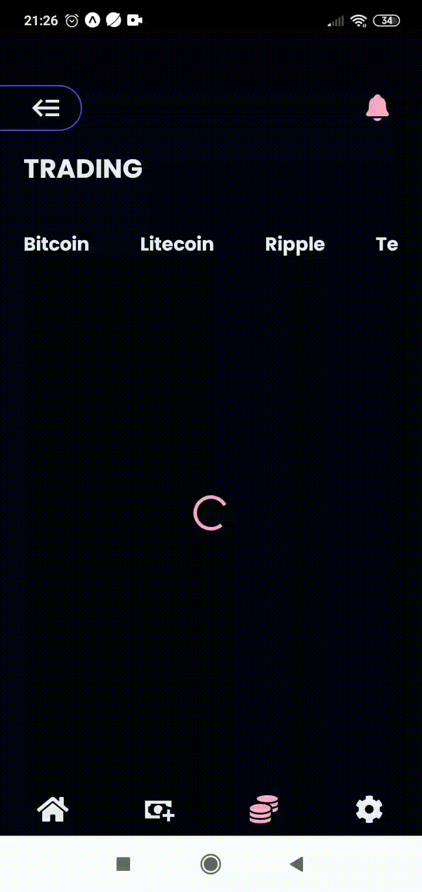

<h1 align="center">BITIFY - React Native :moneybag:</h1>

<p align="left">Aplicação moderna construida com React Native usando expo, consumindo uma API externa de criptomoedas (COINAPI), com o intuito de trazer um painel financeiro completo de cada ativo e com a opção de fazer uma simulaçao real de cada ativo.  </p>

##

<br>


<h1 align="left">
  
  
  
  
</h1>


## Tecnologias :hammer_and_pick:

As seguintes ferramentas foram usadas na construção do projeto:

- [x] [TypeScript](https://www.typescriptlang.org/)
- [x] [React-Query](https://tanstack.com/query/v4/docs/overview)
- [x] [axios](https://axios-http.com/ptbr/docs/intro)
- [x] [Context API](https://pt-br.reactjs.org/docs/context.html)
- [x] [UUID](https://www.npmjs.com/package/uuid) 
- [x] [JavaScript](https://developer.mozilla.org/pt-BR/docs/Web/JavaScript)
- [x] [React Native](https://reactnative.dev/)
- [x] [React Navigation](https://reactnavigation.org/)
- [x] [React Native Vector Icons](https://github.com/oblador/react-native-vector-icons)
- [x] [Styled Components](https://styled-components.com/)
- [x] [EXPO](https://expo.dev/) <br/>
- [x] [UUID](https://www.npmjs.com/package/uuid) <br/>
- [x] [Resposive-font-size](https://www.npmjs.com/package/react-native-responsive-fontsize) <br/>
- [x] [React-native-calendars](https://github.com/wix/react-native-calendars) <br/>
- [x] [Lottie-react-native](https://github.com/lottie-react-native/lottie-react-native) <br/> 
- [x] [Async-storage](https://reactnative.dev/docs/asyncstorage)<br/>
- [x] [React-Native-chart-kit](https://github.com/indiespirit/react-native-chart-kit)

## Pré-requisitos

Antes de começar, você vai precisar ter instalado em sua máquina as seguintes ferramentas:
[GIT](https://git-scm.com/), [Node.js](https://nodejs.org/en/).

Além disto é bom ter um editor para trabalhar com o código como [VSCode](https://code.visualstudio.com/)


## Rodando o App

```bash
# Clone este repositório
$ git clone https://github.com/CleberWacheski/Easy-Bank
# Acesse a pasta do projeto no terminal/cmd
$ cd Easy-Bank
# Instale as dependências
$ npm install 
# Inicie o expo
$ npm run
```

